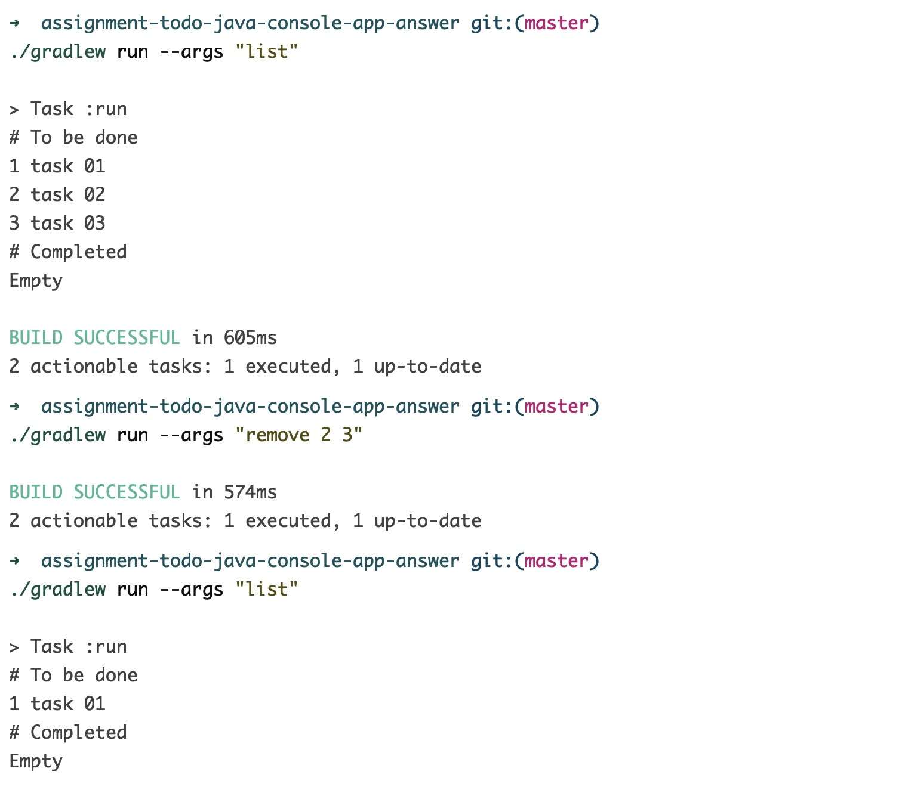

# Assignment todo Java Console Application

## 简介

本次 assignment 的目标是实现一个 Java Console Application。

## 需求说明

除实现 Step01 `assignment-todo-cli` 的需求外，此次 assignment 还需实现新命令 remove，需求描述如下

### `remove` command

用户通过该命令删除任务，示例如下：



删除任务的具体要求有：

1. 需通过参数指定任务的 ID；
2. 如果要一次性指定多个任务，任务 ID 之间以空格分隔；
3. 指定的任务不存在时，无需输出任何提示，视为操作成功；
4. ID 中包含非数字字符时，请等同于“任务不存在”场景，进行处理；
5. 删除任务后，继续添加任务时，不能复用已有的 ID；（例如，已有任务 ID 为 1、2、3，删除 ID 为 2 的任务后，新增任务，则新任务 ID 为 4）

结合上一次 assignment review 的大部分结果，**请务必注意**：

1. 所有固定的输出内容，如：“命令不存在的提示”、“初始化成功后的提示”，要同需求描述或截图完全一致，否则自动化测试会判其为失败；
1. 需求中对于任何不确定的细节，请及时跟 coach 联系、确认；

## 技术要求

1. 在代码库的根目录下，可以通过以下方式运行你的 Java Console Application：
   ```
   # 每一个 add 命令下方都给出了执行后再用 list 查看的结果，供大家详细了解具体的格式，如空格的数量和单引号是否存在等等

   ./gradlew run --args "init"
   Initialized successfully.

   ./gradlew run --args "list"
   # To be done
   Empty
   # Completed
   Empty

   ./gradlew run --args "add foobar"
   # To be done
   1 foobar
   # Completed
   Empty

   ./gradlew run --args "add foobar buzz"
   # To be done
   1 foobar
   2 foobar buzz
   # Completed
   Empty

   ./gradlew run --args "add 'foo bar'"
   # To be done
   1 foobar
   2 foobar buzz
   3 foo bar
   # Completed
   Empty

   ./gradlew run --args "add 'foo    bar'"
   # To be done
   1 foobar
   2 foobar buzz
   3 foo bar
   4 foo    bar
   # Completed
   Empty

   ./gradlew run --args "add foobar 'foo   bar'"
   # To be done
   1 foobar
   2 foobar buzz
   3 foo bar
   4 foo    bar
   5 foobar foo   bar
   # Completed
   Empty
   ```
1. 如无需传任何参数，请使用以下方式：
   ```
   ./gradlew run
   ```
1. 不允许修改 build.gradle 文件，如有特殊原因，请先跟 coach 进行沟通；
1. 不允许以任何形式自行添加任何其它第三方依赖或库带代码库中；
1. 如需在磁盘上保存任何数据，请确保符合以下要求：
   1. 所有的数据均保存在 `$HOME/.todo/tasks`文件中，不可以再创建其它任何文件；
   1. **再强调一遍，不管是什么数据，统统只能放到 `$HOME/.todo/tasks` 文件中；**
   1. 纯文本是指当使用`cat $HOME/.todo/tasks`的方式来查看文件内容时，其内容对人类是可读的；
   1. 不要对文件内容进行任何形式的编码（如：Base64 等）或加密（如：AES、DES 等）；
   1. 数据文件`$HOME/.todo/tasks`内的的具体数据保存格式需自行设计；
1. 不可以使用任何方式的网络通讯；
1. 不可以使用数据库，如需存储、读取数据，请使用 `$HOME/.todo/tasks`文件；
1. 使用 Git 进行版本管理：
   1. 小步提交；
   1. 使用合理的 commit message；
   1. Commit message 格式需符合 [Conventional Commits](https://www.conventionalcommits.org/) ；
1. 以下使用场景，它们不在目标考查范围内，你无需为它们做特别处理：
   1. 并发的使用场景，换言之，就是无需考虑是否有多个使用者和（/或）多处在同时运行某个 todo command；
   1. 不必为可创建的任务数量的上限做任何处理，即可以支持无限多的任务，直到 系统/机器 挂掉为止；（我们目前不会这样去 使用/测试 它）
   1. 任务标题的长度也无需做任何限制，同上，我们不会变态的去做这样的测试；（但不代表未来真实的项目里没有这种人或这样的情况😁）

## 提交要求

1. 请在 coach 建议的完成时间内提交，提交时请确保录屏也已完成；
2. **注意: 同学录屏时必须安装并开启 IDEA "Presentation Assistant" 插件，确保 Buddy 可以观察到具体快捷键操作**
3. **注意: 快捷键使用刻意练习。本次 Assignment 中需要掌握 “打开 Terminal” （Mac：⌥ + F12， Windows：Alt + F12）的快捷键使用，请确保录屏中包含了该快捷键的使用**
3. 通过金数据表单提交 assignment，提交成功后会收到系统通知；
4. 批改 assignment 会使用提交时间点所对应的版本，请务必在确认无误后再进行提交；
5. 获取录屏的具体方式请写在 RECORDING.md 文件中，确保 buddy/coach 能够访问；
6. 本次 assignment 录屏时长需在 **45** 分钟以内；

## 评分标准

Buddy 会根据以下指导规则对大家本次的 assignment 进行评级。

**特别提醒：**

本次 assignment 只是为了帮助大家了解自己的学习情况，不是为了考试评级，请大家不要有过多的心理负担。

给出一个明确的评级指导规则，是为了一方面让 buddy 们尽量能够统一标准。另一方面，也让大家能够明确目标。

对于初学者而言，能在学完当前 Step 后：

* 做到 Level-1 👉🏻 不错喽
* 做到 Level-2 👉🏻 很好
* 做到 Level-3 👉🏻 Fantastic!

### 功能实现

主要判断对需求的实现程度，会分为四个级别：

1. Level-0：无法达到 Level-1 时
2. Level-1：
   1. 能跑起来，可以使用最最简单的 1-2 个命令就算“能跑起来”
   2. 录屏中使用了 **“打开 Terminal”** 快捷键
3. Level-2：满足所有基本操作，能处理大部分常见的`正常和异常`使用场景
4. Level-3：能够处理全部或绝大部分的异常场景；

级别为递进关系，当前 Level 的所有测试必须全部通过，才能判定为达到该 Level。

### 代码实现

当前 assignment 不对代码实现做以下具体要求：

1. 是否使用了 `~/.todo/tasks` 以外的文件来保存数据；

关于该维度的其它方面，暂时不做过多具体要求。

### 工程实践

当前学习阶段主要关注以下工程实践，请在观看录屏后进行反馈：

1. 在录屏中使用 **“打开 Terminal”** 快捷键
2. 根据视频判断是否是自己完成的，不是简单的记忆、模仿；
3. 是否有在命令行使用 Git；
4. 是否实践了小步提交，且 message 内容合理；
5. 要保证 `./gradlew build` 是`干净的`，没有任何 warnings；

## 我应该学到什么？

Assignment 的目的是学以致用，在运用当前 step 所学的知识和技能合理完成题目要求的前提下，你 应该/可能 会使用（但不限于）以下内容：

1. 使用 CLI git 完成本地的提交管理及与远端的各种同步操作；
2. 在 Java 中 [如何](https://stackoverflow.com/a/586345) 获取用户的 $HOME 目录位置；
3. 在 Java 中对文件路径进行操作，推荐使用 [Path API](https://www.novixys.com/blog/java-path-api-tutorial/) ；
4. Java 的基础语法
   1. if/for 等控制语句
   1. 创建文件夹及文件
   1. 文件读写（推荐使用 BufferedReader 和 BufferedWriter，这里是一个 [参考](https://www.youtube.com/watch?v=hgF21imQ_Is) ）
5. 通过 Gradle 在 console 里运行一个 Java Application；
6. 快捷键“打开 Terminal”的使用

**如果你在完成 assignment 后，发现以上的大部分内容都并未涉及（使用）到，请及时联系 coach 进行沟通。**
